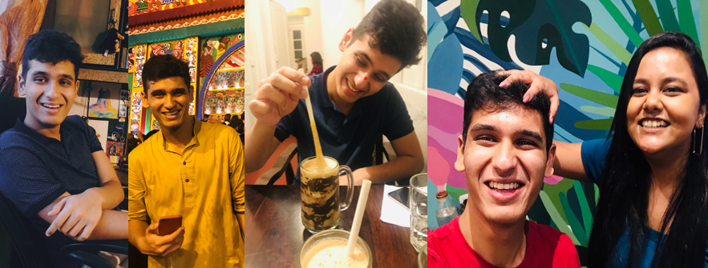
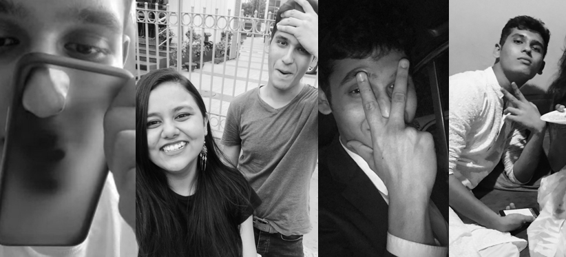
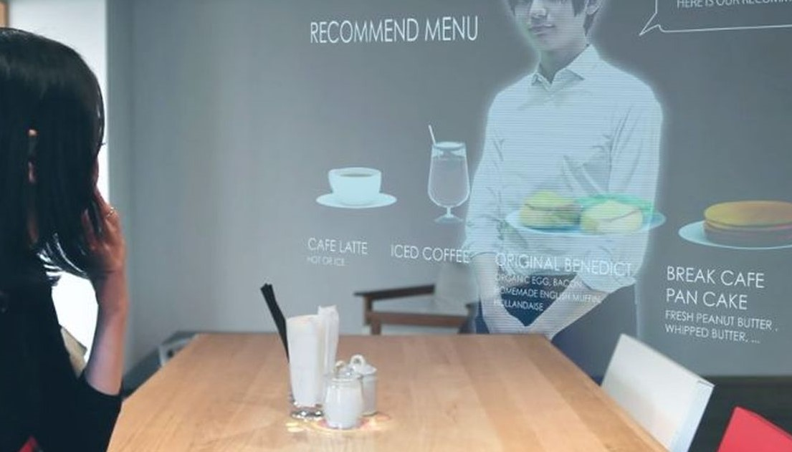
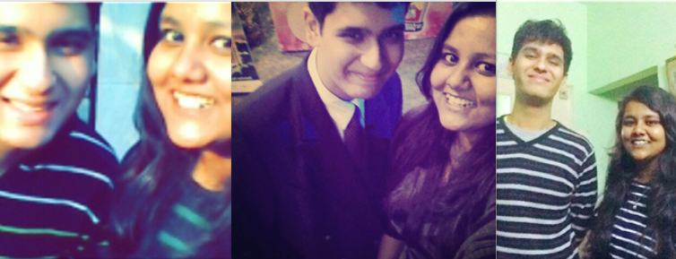
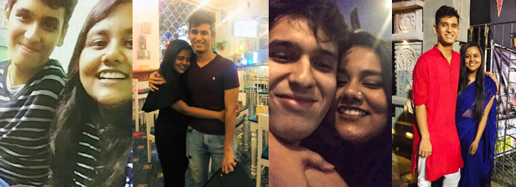

# to P, with love.

## Welcome to Prithviraj Choudhury's Birthday

.jpg)

### 23 years ago this blob came into being, and he brought with him a WORLD of sunshiny happiness and warmth. Even today, he brings that same ooey-gooey love, light and laughter into the lives he touches. Just look at that infectious grin.


**He might be a lil weird sometimes, but he's the best kind of weird.**


You can use the [editor on GitHub](https://github.com/AshmitaRoy/aschmut/edit/master/index.md) to maintain and preview the content for your website in Markdown files.

**This entire webpage is yes, simply a chance for me to flex my Comp Sci major hard.**

< span style="color: red;">
```markdown
<span style="color: gray;"> Of course I HAD to add a sprinkling of STEM-my looking 
code that you'll excitedly exclaim 'I KNOW LINUX!" at : </span>

NO, I don't know how to build holograms but one day,
for your SUPER POPULAR futuristic cafe, if you need me ;
I hope with my 'AI Coding Skills I can make this for you. </span>

```

.jpg)



### LIFE-CHANGING NO-CONTEXT QUOTES BY PRITHVIRAJ CHOUDHURY

- " If you increase distance enough you find people from Dhaka, I speak from experience " 
- " Ooh with this toy doctor set I can play the role of your father "
- " Ya I own you, you're basically my uterus "
- " Of course I know PEEDIPIE I'm a LAWYER"
- " Listen. " * cue Aschmut panique *
- " I played with that man's monkey "
- " She stole my dad's Tommy "
- " No 🐱 for RJ Sayan "
- " Nyangto Yaksha Dul "
- " Neel ghumiye poro "
- " Ki dinkal thakur "
- " No matter how choppy the ocean gets, we shall always find our way back home. We shall moor in the safety of our friendship and the love we share. I hope we can always be each others' anchor " *(the most r/wholesome words ever written to me, thank you )*


### THANK YOU FOR HAVING PLAYED MULTIPLE ROLES IN MY LIFE


### Header 3


`code text testing`
[Link](url) and 


### Foetus Photos of Aschmut and her Preatvi


#### With lots of love from your Chikorita Babe
**(whose evolution in your life has been as follows)** 


- From being a **"Grammar Nazi sarcastic bhalo meye"** your dada told you about who scrinshutted things for you
- to becoming your **German Dessert Chikorita** despite the worst deflection tactic of all time (PUCK-PUCK-PUCK)
- to being a **Sweet summers child** who went AWOL and resurfaced via email MONTHS later (I'm REALLY sorry)
- to being **Bara Dank Tadpole** with her proximity crush after the prissybetch prank
- to my final evolution into a **"CM-Fearing Potol Eating Plebby Name Lovin' Tor-Baap Sticker Making Raagi Cartoon Babe"


### Squishie maxx from Dank Tadpole to her Paul Pew Pew


#### I'm lucky to have known you all these years and I can't imagine not having you as a part of my life. I love you more than 3000.

Crossword [Crossword_Page?](https://guides.github.com/features/mastering-markdown/).

### Support or Contact

Having trouble with Pages? Check out our [documentation](https://help.github.com/categories/github-pages-basics/) or [contact support](https://github.com/contact) and we’ll help you sort it out.
