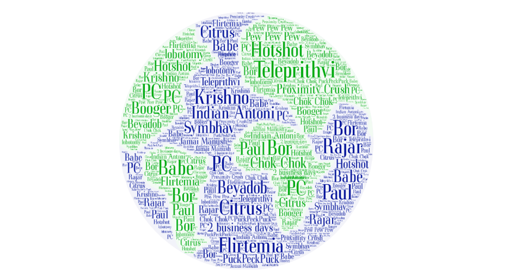
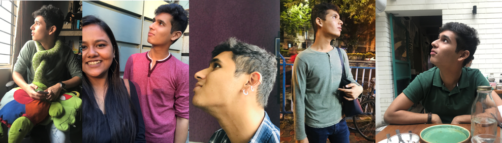
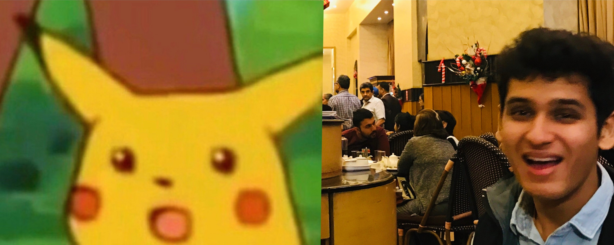
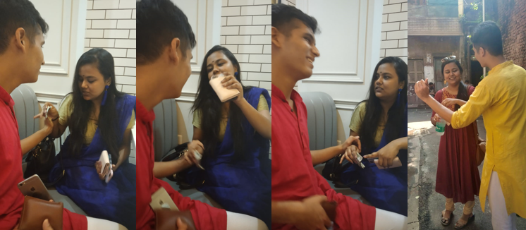
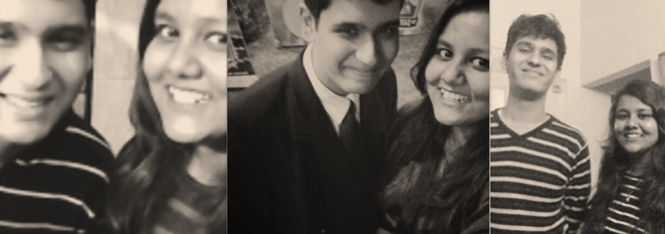

# to P, with love on his 23rd.

## Welcome to Prithviraj Choudhury's Birthday

.jpg)
<br> 
<span style="color: MEDIUMSEAGREEN;"> <b> 23 years ago this blob came into being, and he brought with him a WORLD of sunshiny happiness and warmth. Even today, he brings that same ooey-gooey love, light and laughter into the lives he touches. Look at that infectious grin </b> </span>


<span style="color: STEELBLUE;"> <b> He doesn't look a day over 21 but you can see the striking resemblance to Antoni Porowski, and, if you focus your third eye hard enough you can actually glimpse some of Vidyut Jammwal's abs in him too. He might be sniffing a droplet of Skippy Peanut Butter for breakfast but he is al actually glimpse some of Vidyut Jammwal's abs in him too. He might be sniffing a droplet of Skippy Peanut Butter for breakfast but he is al  actually glimpse some of Vidyut Jammwal's abs in him too. He might be sniffing a droplet of Skippy Peanut Butter for breakfast but he is al  actually glimpse some of Vidyut Jammwal's abs in him too. He might be sniffing a droplet of Skippy Peanut Butter for breakfast but he is al  actually glimpse some of Vidyut Jammwal's abs in him too. He might be sniffing a droplet of Skippy Peanut Butter for breakfast but he is al  </b> </span>

<br><br>

<h3 style="background-color: TURQUOISE"> What is Prithvi? Who is Prithvi? Why is Prithvi? </h3> 
<br>


<br><br>

**He might be a lil weird sometimes (pix below), but he's the best kind of weird.**
<br>

 
<br><br><br>

<h3 style="background-color:MINTCREAM"> POEM ( not sanitiser poetry thankfully ) </h3> 

<br> 

<ul style="list-style-type:none;"> <b>
<span style="color: MEDIUMSLATEBLUE;"> <li> Blah Blah Blah </li> </span>
<span style="color: MEDIUMSEAGREEN;"> <li> Blah Blah Blah Blah Blah </li> </span> </b> </ul> 

**If you checked yourself out anymore, Target would buy you. The award for the MOST number of not-subtle jawline flexes during selfies, photographs, video calls and even while passing by anything remotely reflective goes to...**
<br>


<br><br><br>

<p style="background-color:LIGHTCORAL"><b>This entire webpage is yes, simply a chance for me to flex my Comp Sci major hard.</b></p>
```markdown
<span style="color: gray;">
  Of course I HAD to add a
  sprinkling of geeky looking 
  code that you'll excitedly 
  exclaim 'I KNOW LINUX!" at. : </span>

<br>
NO, I don't know how to build holograms but one day,
for your SUPER POPULAR futuristic cafe, if you need me ;
I hope with my 'AI Coding Skills' I can make some for you.

#end markdown code
```
<br>
**Holographic menus and holograms representing (German?) dessert for your eatery.**
<br>
*No hologram chok chok because mass lobotomies are exp and black money is limited* 
<br>

 
<br><br> <br>

<h3 style="background-color:YELLOW"> LIFE-CHANGING NO-CONTEXT QUOTES BY PC </h3> 
**These quotes might seem like there's been some Masaledar Paraphrasing, but NO.**


<br> 

- " If you increase distance enough you find people from Dhaka, I speak from experience " 
- " Ooh with this toy doctor set I can play the role of your father "
- " Jotno kore tuley rakhlam in my cupboard of bekar opinions "
- " I asked you to be pregnant, but you refused "
- " We are more intricate than Game of Thrones "
- " Ya I own you, you're basically my uterus "
- " Of course I know PEEDIPIE I'm a LAWYER "
- " AshmitaRoyal and the Gobet of Desire "
- " I played with that man's monkey "
- " Listen. " *cue Aschmut panique*
- " She stole my dad's Tommy "
- " You should Twi-harder "
- " No 🐱 for RJ Sayan "
- " Nyangto Yaksha Dul "
- " Neel ghumiye poro "
- " Ki dinkal thakur "
- " Doing the Dishes "
- " Khali bari chai "
- " Spaghetti "
- " Whats BDE "
- <span style="color: CRIMSON;"> <b> "No matter how choppy the ocean gets, we shall always find our way back home. We shall moor in the safety of our friendship and the love we share. I hope we can always be each others' anchor " *(the most r/wholesome words ever written to me, thank you )* </b> </span>


<h3 style="background-color:TURQUOISE"> THANK YOU FOR PLAYING MULTIPLE ROLES IN MY LIFE </h3> 
**"Everyone is everyone's everything"**
- LIST WITH PIX
- Numbered list
- or can mkae a collage and upload, easier
- Numbered list
- or can mkae a collage and upload, easier
- Numbered list
- or can mkae a collage and upload, easier
- Numbered list
- or can mkae a collage and upload, easier
- Numbered list
- or can mkae a collage and upload, easier

<h3 style="background-color:TURQUOISE"> IMPORTANT QUOTES / LIFE LESSONS FROM DANK TADPOLE  </h3> 
- " NO! "
- " Oh fuck "
- " Shubho Bijoya "
- " Tor nei tor ___ o nei"
- " Shut up and take my money" 
( and stop calling it black money, that's sexist)


- " Shut up and accept Ayush > Coke Studio names "
- " Shut up and learn to love potol"
- " Shut up and stop risking your bous for dumb pranks "
- " Putting an r/ before any word doesn't make it Reddit"
- " Shut up and learn to love potol"
- " Shut up and stop risking your bous for dumb pranks "
- " Putting an r/ before any word doesn't make it Reddit"
- " Shut up and learn to love potol"
- " Shut up and stop risking your bous for dumb pranks "
- " Putting an r/ before any word doesn't make it Reddit"
- " Shut up and learn to love potol"
- " Shut up and stop risking your bous for dumb pranks "
- " Putting an r/ before any word doesn't make it Reddit"
- " Shut up and learn to love potol"
- " Shut up and stop risking your bous for dumb pranks "
- " Putting an r/ before any word doesn't make it Reddit"


</span>

### NO CONTEXT INSIDE JOKES / CROSSWORD??

- Basic Betch + Acid = Salt & Water, hence Baby Nunu & Baby Panu
- Raja-r Disha
- Nengti Eeedur
- Emni krli toh??
- BaJ Tokapi Linux
- After all these years? Olvez

<br><br>

## Old Mems
**Time Capsule-worthy foetus Photos of Aschmut and her Preatvi**


#### With lots of love from your Chikorita Babe
**(whose evolution in your life has been as follows)** 

- From being a **"Grammar Nazi sarcastic bhalo meye"** your dada told you about who scrinshutted things for you
- to becoming your **German Dessert Chikorita** despite the worst deflection tactic of all time (PUCK-PUCK-PUCK)
- to being a **Sweet summers child** who went AWOL and resurfaced via email MONTHS later (I'm REALLY sorry)
- to being **Bara Dank Tadpole** with her proximity crush after the prissybetch prank
- to my final evolution into a **CM-Fearing Potol Eating Plebby Name Lovin' Tor-Baap Sticker Making Raagi Cartoon Babe**


<br><br>

<h3 style="background-color:GOLD">  2019 Letter </h3> 
<span style="background-color: PAPAYAWHIP;"> So many people have asked me Why and HOW I’m friends with you after all these years. 
In my head, the answer is simple but I guess it isn’t to outsider perspectives. I used to say “Oh it’s because Prithvi is just the nicest person ever” but it’s not just that. You’re not just nice, you’re such a kind, dependable, intelligent, considerate, generous, patient, sensitive, starving, good human being and I’m beyond lucky to have you in my life, no ragretz about anything. Everything is just easy and comfy with you and I hope we never stop with the witty bants, the teleprithvi, the scandalous inside jokes, the millennial lingo tewshun, the random TMI-ness and just being there for each other through everything. If the strength of the love and friendship we share can help you overlook the SUPREME betrayal of me eating the occasional egg biryani or potol bhaja, we’re going to be annoying each other for a long long time. PS: I beg you to yeet that poem sanitiser and those cringe max wallet notes into the void the mere thought of them makes me want to commit sudoku. </span>
<br>
### All my love to my literal world, jk you’re still Tokapi, many potols to you from Chikorita. I'm lucky to have known you all these years and I can't imagine not having you as a part of my life.
#### I love you, more than 3000.
## All my best, Aschmut.


<h4 style="background-color:PEACHPUFF"> Lots of squishy hugs maxx from bete Dank Tadpole: </h4> 


<br><br><br>

<h3 style="background-color:YELLOW"> Shameless Social Media Promotion  </h3> 
<h4 style="background-color:HOTPINK"> Instagram or it (unnecessarily reporting for sexual harassment) didn't happen. </h4> 

- **Instagram Clout for Proximity Crush : ** 
>> [prithvi2804's IG Aesthetic](https://www.instagram.com/prithvi2804/)
- **Instagram Clout for Creator of this Webpage at :** 
>> [ashmitaroyal's Cuter IG Aesthetic](https://www.instagram.com/ashmitaroyal/)

<br> <br> <br>

<h3 style="background-color:YELLOWGREEN"> Support or Contact </h3> 
Having trouble viewing this webpage? 
Check out the [documentation](https://help.github.com/categories/github-pages-basics/) or email me at
<a href="mailto:ashmitaroye@icloud.com">ashmitaroye@icloud.com</a> and I’ll help sort it out.
